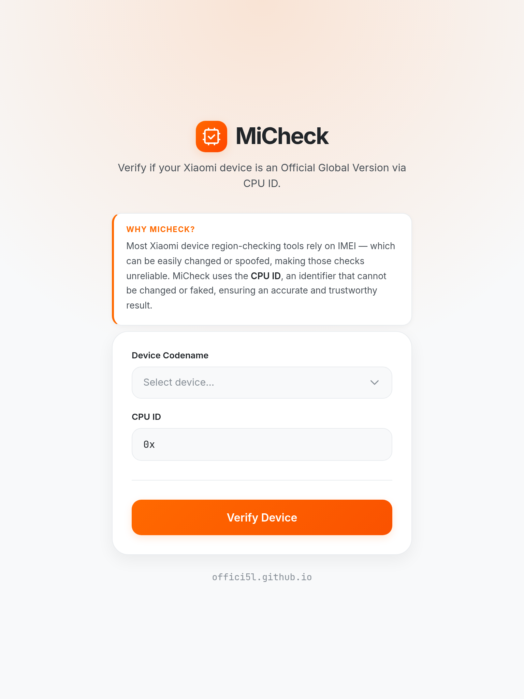

**MiCheck**

**Verify whether your Xiaomi device is an Official Global Version**

https://offici5l.github.io/MiCheck

---

## Why MiCheck?

Unlike IMEI-based checks, **MiCheck** verifies whether your Xiaomi device is a genuine Global Version using the CPU ID — a hardware identifier that cannot be altered or spoofed.

